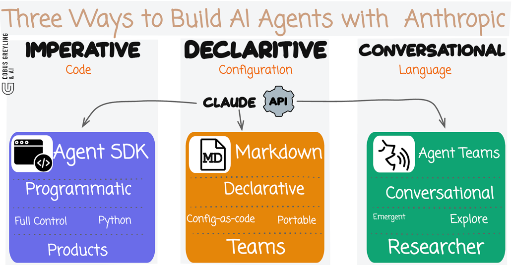
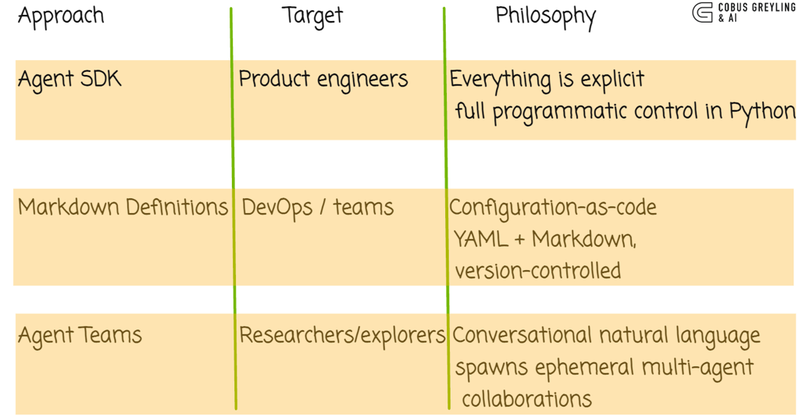
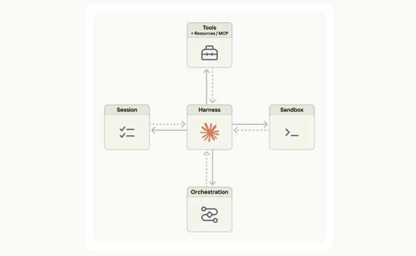
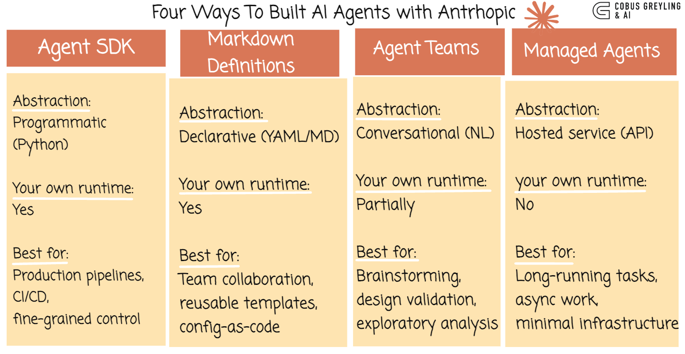

# Claude Managed Agents: The Fourth Way to Build AI Agents With Claude

In a recent post, I explored the [Three Ways to Build AI Agents With Claude](https://cobusgreyling.medium.com/three-ways-to-build-ai-agents-with-claude-54db80194127) — the Agent SDK, Markdown Agent Definitions, and Agent Teams. My core thesis was that Anthropic is doing something unusual: rather than consolidating around a single framework like most AI platforms, they're shipping multiple paradigms simultaneously, trusting developers to pick the right abstraction for the problem at hand.

On 8 April 2026, Anthropic added a **fourth paradigm** to that lineup: **Claude Managed Agents**.

And it changes the picture significantly.

---

## A Quick Recap: The Original Three

Before diving in, here's where we left off:





| Approach | Target | Philosophy |
|----------|--------|------------|
| **Agent SDK** | Product engineers | Everything is explicit — full programmatic control in Python |
| **Markdown Definitions** | DevOps / teams | Configuration-as-code — YAML + Markdown, version-controlled |
| **Agent Teams** | Researchers / explorers | Conversational — natural language spawns ephemeral multi-agent collaborations |

These three approaches share a common trait: **you own the runtime**. Whether you're writing Python, committing YAML files, or prompting in natural language, the agent loop, tool execution, and infrastructure are your responsibility.

Managed Agents flips that on its head.

---

## What Are Claude Managed Agents?

Claude Managed Agents is a **hosted service** where Anthropic runs the agent on your behalf. Instead of building your own agent loop, managing tool execution, and provisioning infrastructure, you get a fully managed environment where Claude can read files, run shell commands, browse the web, and execute code — all inside secure, sandboxed containers in Anthropic's cloud.

Think of it this way:

- The **Agent SDK** is like renting a kitchen and cooking the meal yourself.
- **Markdown Definitions** are like writing the recipe and handing it to your team.
- **Agent Teams** are like describing what you want to eat and letting a group figure it out.
- **Managed Agents** is like ordering from a restaurant — you say what you want, and the kitchen, the chef, the plating, and the cleanup are all handled for you.

---

## The Architecture: Brain, Hands, and Memory

Anthropic published an [engineering deep-dive](https://www.anthropic.com/engineering/managed-agents) explaining the fundamental design principle behind Managed Agents: **decoupling the brain from the hands**.

The system is built around three virtualised components:



### 1. Session (State Management)

The session is a durable, append-only event log that lives outside Claude's context window. It provides persistent memory across interactions. You can retrieve positional slices of the event stream, rewind to previous moments, or pick up exactly where you left off.

### 2. Harness (Orchestration Loop)

The harness is the orchestration layer — it calls Claude, routes tool invocations to the right infrastructure, and writes events to the session. Critically, the harness is **stateless**. If it crashes, a new instance boots up, reads the session log, and resumes without data loss.

### 3. Sandbox (Execution Environment)

Containers are treated as cattle, not pets — interchangeable, disposable execution environments. If a container fails, the harness treats it as a tool-call error and passes that feedback to Claude. New containers spin up without manual intervention.

This decoupled architecture delivers real performance gains. Anthropic reports that time-to-first-token improved approximately **60% at p50** and **over 90% at p95**, because sessions no longer wait for full container initialisation.

---

## How It Works: Step by Step

Working with Managed Agents follows a clear four-step flow:

### Step 1: Create an Agent

Define what the agent is — its model, system prompt, and available tools. This is a one-time setup that you reference by ID.

```python
from anthropic import Anthropic

client = Anthropic()

agent = client.beta.agents.create(
    name="Coding Assistant",
    model="claude-sonnet-4-6",
    system="You are a helpful coding assistant.",
    tools=[{"type": "agent_toolset_20260401"}],
)
```

The `agent_toolset_20260401` tool type enables the full pre-built tool suite: bash, file operations, web search, and more.

### Step 2: Create an Environment

Define the container where the agent will run — packages, network access, mounted files.

```python
environment = client.beta.environments.create(
    name="dev-env",
    config={
        "type": "cloud",
        "networking": {"type": "unrestricted"},
    },
)
```

### Step 3: Start a Session

Launch a running instance that ties your agent to its environment.

```python
session = client.beta.sessions.create(
    agent=agent.id,
    environment_id=environment.id,
    title="Build feature X",
)
```

### Step 4: Send Events and Stream Responses

Send user messages and receive real-time streaming events as the agent works.

```python
with client.beta.sessions.events.stream(session.id) as stream:
    client.beta.sessions.events.send(
        session.id,
        events=[{
            "type": "user.message",
            "content": [{"type": "text", "text": "Your task here"}],
        }],
    )

    for event in stream:
        match event.type:
            case "agent.message":
                for block in event.content:
                    print(block.text, end="")
            case "agent.tool_use":
                print(f"\n[Using tool: {event.name}]")
            case "session.status_idle":
                print("\nAgent finished.")
                break
```

You can also **steer or interrupt** the agent mid-execution by sending additional events — a key differentiator from fire-and-forget designs.

---

## Security: Credentials Never Reach the Sandbox

One of the most thoughtful aspects of the architecture is how it handles secrets. **Credentials never reach the sandbox where Claude's generated code executes.**

Two patterns are used:

- **Repository tokens** are used during sandbox initialisation to clone repos and wire into git remotes. Push/pull operations work without the token being accessible to generated code.
- **OAuth tokens** for custom tools remain in a secure vault. A dedicated proxy handles authentication, fetching credentials only when Claude calls MCP (Model Context Protocol) tools.

This is a meaningful security boundary that would be difficult and error-prone to implement yourself.

---

## The Updated Landscape: Four Paradigms

Here's how the picture now looks with Managed Agents added:



| Approach | Abstraction | You Own the Runtime? | Best For |
|----------|------------|---------------------|----------|
| **Agent SDK** | Programmatic (Python) | Yes | Production pipelines, CI/CD, fine-grained control |
| **Markdown Definitions** | Declarative (YAML/MD) | Yes | Team collaboration, reusable templates, config-as-code |
| **Agent Teams** | Conversational (NL) | Partially | Brainstorming, design validation, exploratory analysis |
| **Managed Agents** | Hosted service (API) | No | Long-running tasks, async work, minimal infrastructure |

---

## How Managed Agents Differs From the Original Three

### vs. the Agent SDK

The Agent SDK gives you full programmatic control — you write the agent loop, manage the conversation state, choose when to call tools, and decide how to handle errors. Managed Agents abstracts all of that away. You define the *what* (agent config, environment, task), and Anthropic handles the *how* (orchestration, execution, recovery).

**Trade-off:** You lose fine-grained control but gain resilience, scalability, and zero infrastructure overhead.

### vs. Markdown Definitions

Markdown agent definitions live in your repo and run wherever you deploy them. They're portable and version-controlled. Managed Agents are cloud-native — they run in Anthropic's infrastructure and are configured via API calls rather than files.

**Trade-off:** You lose portability and local execution but gain managed containers, built-in sandboxing, and persistent sessions.

### vs. Agent Teams

Agent Teams are ephemeral, conversational, and exploratory. Managed Agents are persistent, API-driven, and production-oriented. Where Teams self-organise around a prompt, Managed Agents execute within defined boundaries with full event logging.

**Trade-off:** You lose the organic, multi-perspective brainstorming capability but gain durability, auditability, and long-running execution.

---

## Pricing

The pricing model is straightforward:

- **Token usage:** Standard Anthropic API pricing
- **Runtime:** $0.08 per session-hour (active runtime only — idle time doesn't count)
- **Web search:** $10 per 1,000 searches

This makes it economically viable for long-running tasks without penalising you for wait states.

---

## Who's Already Using It?

Early enterprise adopters include **Notion, Rakuten, Asana, Vibecode, and Sentry** — spanning code automation, productivity workflows, HR, and finance.

---

## What This Means Strategically

In my original post, I highlighted two critical beliefs driving Anthropic's approach:

1. No single correct abstraction exists for agent orchestration
2. Developer choice matters more than platform prescription

Managed Agents reinforces both beliefs — and extends them. Anthropic isn't just offering multiple abstractions for *building* agents; they're now also offering the option to not build the infrastructure at all.

The evolution mirrors a pattern we've seen across all of infrastructure:

| Era | Build | Configure | Converse | Delegate |
|-----|-------|-----------|----------|----------|
| **Infrastructure** | Shell scripts | Terraform | Natural language | Managed services |
| **CI/CD** | Makefiles | YAML pipelines | AI-driven | Hosted CI |
| **AI Agents** | Agent SDK | Markdown Definitions | Agent Teams | **Managed Agents** |

The fourth column — delegation to a managed service — is the natural next step. You don't always want to run the kitchen. Sometimes you just want dinner.

---

## Getting Started

Managed Agents is currently in **public beta**. All API requests require the `managed-agents-2026-04-01` beta header (the SDK sets this automatically). You need:

1. A Claude API key
2. The beta header on all requests
3. Access is enabled by default for all API accounts

Advanced features like **outcomes**, **multi-agent orchestration**, and **memory** are in research preview with access available on request.

SDKs are available for Python, TypeScript, Go, Java, C#, Ruby, and PHP. There's also a dedicated CLI tool (`ant`) installable via Homebrew, curl, or Go.

---

## Conclusion

When I wrote about the three ways to build AI agents with Claude, I noted that Anthropic was doing something counter-cultural — shipping multiple paradigms instead of prescribing one. Managed Agents doesn't change that philosophy; it *completes* it.

The original three paradigms assumed developers want to build and run their own agent infrastructure, differing only in the level of abstraction. Managed Agents acknowledges that sometimes the answer isn't a different abstraction — it's **no infrastructure at all**.

For teams that want to embed autonomous Claude agents into their products without managing containers, orchestration loops, or failure recovery, Managed Agents is the most direct path from idea to production.

Four paradigms. Four levels of control. One platform. The choice, as always, is yours.
